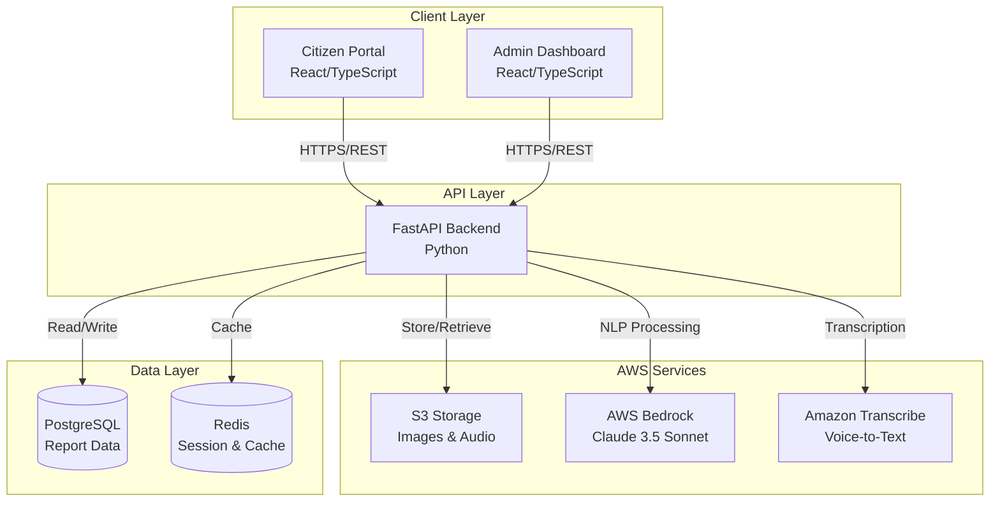
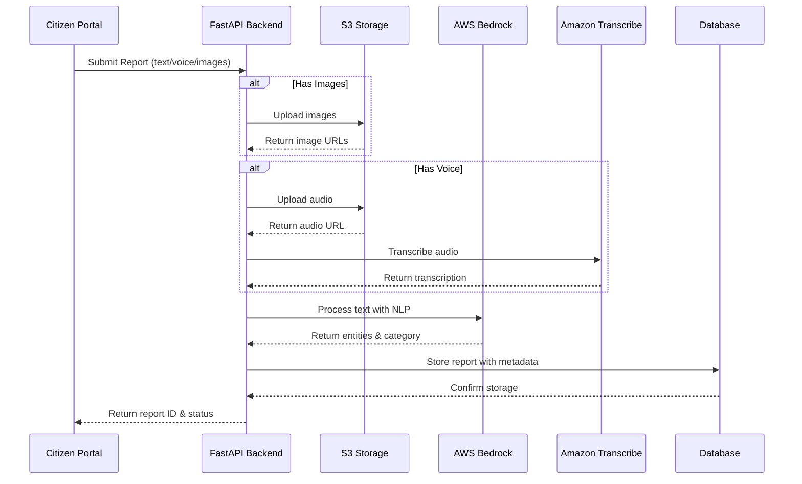

# Design Document: SewaSetu Civic Reporting System

## Overview

SewaSetu is a full-stack civic reporting system that enables citizens to report municipal issues through a React-based web portal while administrators manage these reports through a comprehensive dashboard. The system architecture follows a microservices-inspired approach with clear separation between the frontend (React/TypeScript), backend API (Python FastAPI), and AWS cloud services (Bedrock, Transcribe, S3).

The design emphasizes:
- **Multi-modal input**: Text, voice, and image-based reporting
- **AI-powered processing**: Hinglish NLP using AWS Bedrock Claude 3.5 Sonnet
- **Scalability**: Cloud-native architecture with managed AWS services
- **User experience**: Intuitive interfaces for both citizens and administrators
- **Reliability**: Graceful error handling and asynchronous processing

## Architecture

### High-Level Architecture



### Component Interaction Flow

**Report Submission Flow:**


## Components and Interfaces

### 1. Citizen Portal (React/TypeScript)

**Responsibilities:**
- Provide intuitive UI for report submission
- Handle multi-modal input (text, voice, images)
- Display report status and tracking
- Manage client-side validation

**Key Components:**
- `ReportForm`: Main form component for report submission
- `VoiceRecorder`: Component for capturing and managing voice input
- `ImageUploader`: Component for selecting and previewing images
- `LocationPicker`: Component for selecting location via map or text
- `ReportTracker`: Component for viewing report status
- `LanguageToggle`: Component for switching between English and Hinglish UI

**State Management:**
- Use React Context or Zustand for global state
- Local state for form inputs and UI interactions
- Optimistic updates for better UX

**API Client Interface:**
```typescript
interface ReportSubmission {
  description: string;
  location: LocationData;
  images?: File[];
  audio?: Blob;
  citizenContact?: string;
}

interface LocationData {
  text?: string;
  coordinates?: {
    latitude: number;
    longitude: number;
  };
}

interface ReportResponse {
  reportId: string;
  status: ReportStatus;
  submittedAt: string;
}

interface ReportStatusResponse {
  reportId: string;
  status: ReportStatus;
  category: string;
  department: string;
  submittedAt: string;
  lastUpdated: string;
  comments: Comment[];
}
```

### 2. Admin Dashboard (React/TypeScript)

**Responsibilities:**
- Display and filter reports
- Manage report status and assignments
- Provide analytics and insights
- Handle department workflows

**Key Components:**
- `ReportList`: Paginated list with filtering and sorting
- `ReportDetail`: Detailed view of individual reports
- `FilterPanel`: UI for filtering by category, status, department, date
- `AnalyticsDashboard`: Charts and metrics display
- `DepartmentManager`: Department assignment interface
- `MapView`: Geographic visualization of reports

**API Client Interface:**
```typescript
interface ReportFilter {
  category?: string[];
  status?: ReportStatus[];
  department?: string[];
  dateFrom?: string;
  dateTo?: string;
  searchQuery?: string;
}

interface PaginatedReports {
  reports: Report[];
  total: number;
  page: number;
  pageSize: number;
}

interface Report {
  id: string;
  description: string;
  transcription?: string;
  location: LocationData;
  category: string;
  status: ReportStatus;
  department: string;
  submittedAt: string;
  lastUpdated: string;
  images: string[];
  audioUrl?: string;
  nlpMetadata: NLPMetadata;
  comments: Comment[];
}

interface AnalyticsData {
  reportsByCategory: Record<string, number>;
  reportsByStatus: Record<string, number>;
  avgResolutionTime: Record<string, number>;
  trendData: TrendPoint[];
  departmentMetrics: DepartmentMetric[];
}
```

### 3. FastAPI Backend

**Responsibilities:**
- Handle HTTP requests from frontend clients
- Orchestrate AWS service interactions
- Manage business logic and validation
- Persist data to database
- Implement authentication and authorization

**Project Structure:**
```
backend/
├── app/
│   ├── main.py                 # FastAPI application entry
│   ├── config.py               # Configuration management
│   ├── dependencies.py         # Dependency injection
│   ├── models/
│   │   ├── report.py          # Pydantic models for reports
│   │   ├── user.py            # Pydantic models for users
│   │   └── analytics.py       # Pydantic models for analytics
│   ├── routers/
│   │   ├── reports.py         # Report endpoints
│   │   ├── admin.py           # Admin endpoints
│   │   └── analytics.py       # Analytics endpoints
│   ├── services/
│   │   ├── nlp_service.py     # AWS Bedrock integration
│   │   ├── transcribe_service.py  # Amazon Transcribe integration
│   │   ├── storage_service.py     # S3 integration
│   │   └── report_service.py      # Business logic
│   ├── database/
│   │   ├── models.py          # SQLAlchemy ORM models
│   │   ├── connection.py      # Database connection
│   │   └── repository.py      # Data access layer
│   └── utils/
│       ├── auth.py            # Authentication utilities
│       └── validators.py      # Input validation
└── tests/
```

**API Endpoints:**

```python
# Report Submission
POST /api/v1/reports
  - Body: multipart/form-data with description, location, images, audio
  - Response: ReportResponse with report ID

# Report Status
GET /api/v1/reports/{report_id}
  - Response: Full report details

# List Reports (Admin)
GET /api/v1/admin/reports
  - Query params: category, status, department, date_from, date_to, search, page, page_size
  - Response: PaginatedReports

# Update Report Status (Admin)
PATCH /api/v1/admin/reports/{report_id}/status
  - Body: { status, comment }
  - Response: Updated report

# Assign Department (Admin)
PATCH /api/v1/admin/reports/{report_id}/department
  - Body: { department }
  - Response: Updated report

# Add Comment (Admin)
POST /api/v1/admin/reports/{report_id}/comments
  - Body: { comment }
  - Response: Comment with timestamp

# Analytics (Admin)
GET /api/v1/admin/analytics
  - Query params: date_from, date_to
  - Response: AnalyticsData

# Health Check
GET /api/v1/health
  - Response: Service status
```

### 4. NLP Service (AWS Bedrock Integration)

**Responsibilities:**
- Process Hinglish text using Claude 3.5 Sonnet
- Extract entities (issue type, location, severity)
- Categorize reports automatically
- Return confidence scores

**Implementation:**
```python
class NLPService:
    def __init__(self, bedrock_client):
        self.client = bedrock_client
        self.model_id = "anthropic.claude-3-5-sonnet-20241022-v2:0"
    
    async def process_report(self, text: str) -> NLPResult:
        """
        Process report text and extract structured information.
        
        Returns:
            NLPResult with category, entities, confidence scores
        """
        prompt = self._build_prompt(text)
        response = await self._invoke_bedrock(prompt)
        return self._parse_response(response)
    
    def _build_prompt(self, text: str) -> str:
        """
        Build prompt for Claude to extract civic issue information.
        Handles Hinglish code-switching.
        """
        return f"""Analyze this civic issue report (may be in Hinglish - mixed Hindi and English):

Report: {text}

Extract the following information in JSON format:
1. category: One of [roads, sanitation, water_supply, electricity, street_lighting, parks, other]
2. severity: One of [low, medium, high, critical]
3. location_mentioned: Any location references in the text
4. key_entities: List of important entities (objects, places, issues)
5. confidence: Your confidence in the categorization (0-100)

Respond with valid JSON only."""
```

**Data Models:**
```python
class NLPResult(BaseModel):
    category: str
    severity: str
    location_mentioned: Optional[str]
    key_entities: List[str]
    confidence: float
    raw_response: str
```

### 5. Transcription Service (Amazon Transcribe Integration)

**Responsibilities:**
- Convert audio files to text
- Support Hindi and English languages
- Handle asynchronous transcription jobs
- Return transcribed text with timestamps

**Implementation:**
```python
class TranscriptionService:
    def __init__(self, transcribe_client, s3_client):
        self.transcribe_client = transcribe_client
        self.s3_client = s3_client
    
    async def transcribe_audio(self, audio_url: str, language: str = "hi-IN") -> TranscriptionResult:
        """
        Transcribe audio file from S3.
        
        Args:
            audio_url: S3 URL of audio file
            language: Language code (hi-IN for Hindi, en-IN for English)
        
        Returns:
            TranscriptionResult with text and confidence
        """
        job_name = self._generate_job_name()
        
        # Start transcription job
        await self._start_transcription_job(job_name, audio_url, language)
        
        # Poll for completion
        result = await self._wait_for_completion(job_name)
        
        return self._parse_transcription(result)
    
    async def _start_transcription_job(self, job_name: str, audio_url: str, language: str):
        """Start asynchronous transcription job."""
        self.transcribe_client.start_transcription_job(
            TranscriptionJobName=job_name,
            Media={'MediaFileUri': audio_url},
            MediaFormat='webm',  # or 'mp3', 'wav'
            LanguageCode=language,
            Settings={
                'ShowAlternatives': True,
                'MaxAlternatives': 2
            }
        )
```

**Data Models:**
```python
class TranscriptionResult(BaseModel):
    text: str
    confidence: float
    language: str
    duration: float
    alternatives: List[str]
```

### 6. Storage Service (S3 Integration)

**Responsibilities:**
- Upload images and audio files to S3
- Generate presigned URLs for secure access
- Manage file lifecycle and cleanup
- Validate file types and sizes

**Implementation:**
```python
class StorageService:
    def __init__(self, s3_client, bucket_name: str):
        self.s3_client = s3_client
        self.bucket_name = bucket_name
    
    async def upload_image(self, file: UploadFile, report_id: str) -> str:
        """
        Upload image to S3 and return URL.
        
        Args:
            file: Image file from request
            report_id: Associated report ID for organizing files
        
        Returns:
            S3 URL of uploaded image
        """
        # Validate file
        self._validate_image(file)
        
        # Generate unique key
        key = f"reports/{report_id}/images/{uuid.uuid4()}.{file.filename.split('.')[-1]}"
        
        # Upload to S3
        await self._upload_file(file, key)
        
        return f"s3://{self.bucket_name}/{key}"
    
    async def upload_audio(self, file: UploadFile, report_id: str) -> str:
        """Upload audio file to S3 and return URL."""
        self._validate_audio(file)
        key = f"reports/{report_id}/audio/{uuid.uuid4()}.webm"
        await self._upload_file(file, key)
        return f"s3://{self.bucket_name}/{key}"
    
    def generate_presigned_url(self, s3_url: str, expiration: int = 3600) -> str:
        """Generate presigned URL for secure file access."""
        key = s3_url.replace(f"s3://{self.bucket_name}/", "")
        return self.s3_client.generate_presigned_url(
            'get_object',
            Params={'Bucket': self.bucket_name, 'Key': key},
            ExpiresIn=expiration
        )
```

### 7. Report Service (Business Logic)

**Responsibilities:**
- Orchestrate report submission workflow
- Coordinate between NLP, transcription, and storage services
- Implement business rules and validation
- Handle asynchronous processing

**Implementation:**
```python
class ReportService:
    def __init__(
        self,
        nlp_service: NLPService,
        transcription_service: TranscriptionService,
        storage_service: StorageService,
        repository: ReportRepository
    ):
        self.nlp_service = nlp_service
        self.transcription_service = transcription_service
        self.storage_service = storage_service
        self.repository = repository
    
    async def submit_report(self, submission: ReportSubmission) -> ReportResponse:
        """
        Process and store a new civic report.
        
        Workflow:
        1. Generate report ID
        2. Upload images to S3 (if present)
        3. Upload audio to S3 (if present)
        4. Transcribe audio (if present)
        5. Process text with NLP
        6. Determine category and department
        7. Store report in database
        8. Return report ID and status
        """
        report_id = self._generate_report_id()
        
        # Upload multimedia
        image_urls = []
        if submission.images:
            image_urls = await self._upload_images(submission.images, report_id)
        
        audio_url = None
        transcription = None
        if submission.audio:
            audio_url = await self.storage_service.upload_audio(submission.audio, report_id)
            # Queue transcription for async processing
            transcription = await self._transcribe_async(audio_url)
        
        # Combine text sources
        full_text = submission.description
        if transcription:
            full_text += f" {transcription.text}"
        
        # Process with NLP
        nlp_result = await self.nlp_service.process_report(full_text)
        
        # Determine department
        department = self._assign_department(nlp_result.category)
        
        # Create report entity
        report = Report(
            id=report_id,
            description=submission.description,
            transcription=transcription.text if transcription else None,
            location=submission.location,
            category=nlp_result.category,
            status=ReportStatus.SUBMITTED,
            department=department,
            images=image_urls,
            audio_url=audio_url,
            nlp_metadata=nlp_result,
            submitted_at=datetime.utcnow()
        )
        
        # Persist to database
        await self.repository.create_report(report)
        
        return ReportResponse(
            report_id=report_id,
            status=ReportStatus.SUBMITTED,
            submitted_at=report.submitted_at.isoformat()
        )
```

## Data Models

### Database Schema (PostgreSQL)

```sql
-- Reports table
CREATE TABLE reports (
    id VARCHAR(50) PRIMARY KEY,
    description TEXT NOT NULL,
    transcription TEXT,
    location_text TEXT,
    location_lat DECIMAL(10, 8),
    location_lng DECIMAL(11, 8),
    category VARCHAR(50) NOT NULL,
    status VARCHAR(20) NOT NULL,
    department VARCHAR(100) NOT NULL,
    citizen_contact VARCHAR(100),
    submitted_at TIMESTAMP NOT NULL DEFAULT NOW(),
    last_updated TIMESTAMP NOT NULL DEFAULT NOW(),
    created_at TIMESTAMP NOT NULL DEFAULT NOW()
);

-- Media files table
CREATE TABLE media_files (
    id SERIAL PRIMARY KEY,
    report_id VARCHAR(50) REFERENCES reports(id) ON DELETE CASCADE,
    file_type VARCHAR(10) NOT NULL, -- 'image' or 'audio'
    s3_url TEXT NOT NULL,
    file_size INTEGER,
    created_at TIMESTAMP NOT NULL DEFAULT NOW()
);

-- NLP metadata table
CREATE TABLE nlp_metadata (
    id SERIAL PRIMARY KEY,
    report_id VARCHAR(50) REFERENCES reports(id) ON DELETE CASCADE,
    category VARCHAR(50) NOT NULL,
    severity VARCHAR(20),
    confidence DECIMAL(5, 2),
    location_mentioned TEXT,
    key_entities JSONB,
    raw_response TEXT,
    processed_at TIMESTAMP NOT NULL DEFAULT NOW()
);

-- Comments table
CREATE TABLE comments (
    id SERIAL PRIMARY KEY,
    report_id VARCHAR(50) REFERENCES reports(id) ON DELETE CASCADE,
    user_id VARCHAR(50) NOT NULL,
    comment TEXT NOT NULL,
    created_at TIMESTAMP NOT NULL DEFAULT NOW()
);

-- Status history table
CREATE TABLE status_history (
    id SERIAL PRIMARY KEY,
    report_id VARCHAR(50) REFERENCES reports(id) ON DELETE CASCADE,
    old_status VARCHAR(20),
    new_status VARCHAR(20) NOT NULL,
    changed_by VARCHAR(50) NOT NULL,
    reason TEXT,
    changed_at TIMESTAMP NOT NULL DEFAULT NOW()
);

-- Users table (for admin authentication)
CREATE TABLE users (
    id VARCHAR(50) PRIMARY KEY,
    username VARCHAR(100) UNIQUE NOT NULL,
    email VARCHAR(255) UNIQUE NOT NULL,
    password_hash TEXT NOT NULL,
    role VARCHAR(20) NOT NULL, -- 'admin', 'department_user', 'viewer'
    department VARCHAR(100),
    created_at TIMESTAMP NOT NULL DEFAULT NOW(),
    last_login TIMESTAMP
);

-- Indexes for performance
CREATE INDEX idx_reports_status ON reports(status);
CREATE INDEX idx_reports_category ON reports(category);
CREATE INDEX idx_reports_department ON reports(department);
CREATE INDEX idx_reports_submitted_at ON reports(submitted_at);
CREATE INDEX idx_media_files_report_id ON media_files(report_id);
CREATE INDEX idx_comments_report_id ON comments(report_id);
CREATE INDEX idx_status_history_report_id ON status_history(report_id);
```

### SQLAlchemy ORM Models

```python
from sqlalchemy import Column, String, Text, DECIMAL, Integer, TIMESTAMP, ForeignKey
from sqlalchemy.dialects.postgresql import JSONB
from sqlalchemy.orm import relationship
from datetime import datetime

class ReportModel(Base):
    __tablename__ = "reports"
    
    id = Column(String(50), primary_key=True)
    description = Column(Text, nullable=False)
    transcription = Column(Text)
    location_text = Column(Text)
    location_lat = Column(DECIMAL(10, 8))
    location_lng = Column(DECIMAL(11, 8))
    category = Column(String(50), nullable=False)
    status = Column(String(20), nullable=False)
    department = Column(String(100), nullable=False)
    citizen_contact = Column(String(100))
    submitted_at = Column(TIMESTAMP, nullable=False, default=datetime.utcnow)
    last_updated = Column(TIMESTAMP, nullable=False, default=datetime.utcnow, onupdate=datetime.utcnow)
    created_at = Column(TIMESTAMP, nullable=False, default=datetime.utcnow)
    
    # Relationships
    media_files = relationship("MediaFileModel", back_populates="report", cascade="all, delete-orphan")
    nlp_metadata = relationship("NLPMetadataModel", back_populates="report", uselist=False)
    comments = relationship("CommentModel", back_populates="report", cascade="all, delete-orphan")
    status_history = relationship("StatusHistoryModel", back_populates="report", cascade="all, delete-orphan")
```

### Pydantic Models (API)

```python
from pydantic import BaseModel, Field, validator
from typing import Optional, List
from datetime import datetime
from enum import Enum

class ReportStatus(str, Enum):
    SUBMITTED = "submitted"
    IN_PROGRESS = "in_progress"
    RESOLVED = "resolved"
    REJECTED = "rejected"

class Category(str, Enum):
    ROADS = "roads"
    SANITATION = "sanitation"
    WATER_SUPPLY = "water_supply"
    ELECTRICITY = "electricity"
    STREET_LIGHTING = "street_lighting"
    PARKS = "parks"
    OTHER = "other"

class LocationData(BaseModel):
    text: Optional[str] = None
    coordinates: Optional[dict] = None
    
    @validator('coordinates')
    def validate_coordinates(cls, v):
        if v and ('latitude' not in v or 'longitude' not in v):
            raise ValueError('Coordinates must include latitude and longitude')
        return v

class ReportSubmissionRequest(BaseModel):
    description: str = Field(..., min_length=10, max_length=2000)
    location: LocationData
    citizen_contact: Optional[str] = None

class ReportResponse(BaseModel):
    report_id: str
    status: ReportStatus
    submitted_at: str

class NLPMetadata(BaseModel):
    category: Category
    severity: str
    confidence: float
    location_mentioned: Optional[str]
    key_entities: List[str]

class Comment(BaseModel):
    id: int
    user_id: str
    comment: str
    created_at: datetime

class Report(BaseModel):
    id: str
    description: str
    transcription: Optional[str]
    location: LocationData
    category: Category
    status: ReportStatus
    department: str
    citizen_contact: Optional[str]
    submitted_at: datetime
    last_updated: datetime
    images: List[str]
    audio_url: Optional[str]
    nlp_metadata: NLPMetadata
    comments: List[Comment]
    
    class Config:
        orm_mode = True
```

